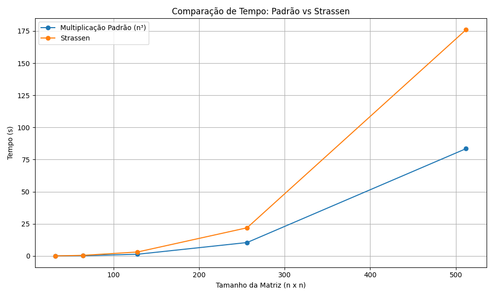

#  Comparação de Algoritmos de Multiplicação de Matrizes

Este projeto compara o desempenho entre a multiplicação padrão de matrizes (complexidade O(n³)) e o algoritmo de Strassen. A análise empírica foi realizada para diferentes tamanhos de matrizes quadradas com valores aleatórios inteiros.
 
  > É importante resssaltar que devido as limitações de hardware presentes, foi inviável realizar os testes do exercício em matrizes de tamanho 100000 x 100000. Por esta razão, fizemos com matrizes de tamanhos menores.

## Objetivo

Avaliar empiricamente a performance do algoritmo de Strassen em comparação com a multiplicação tradicional de matrizes, observando o tempo de execução para diferentes tamanhos.

## Algoritmos Utilizados

- **Multiplicação Padrão (O(n³))**: Implementação com três laços aninhados.
- **Strassen**: Algoritmo recursivo que reduz a complexidade teórica, para matrizes grandes.

## 📊 Resultados Obtidos

Os testes foram realizados com os seguintes tamanhos de matrizes: 32, 64, 128, 256 e 512, por limitação de hardware.

| Tamanho | Tempo Multiplicação Padrão (s) | Tempo Strassen (s) |
|---------|------------------|--------------------|
| 32      | 0.0197           | 0.0651             |
| 64      | 0.2166           | 0.4702             |
| 128     | 1.3313           | 3.0881             |
| 256     | 10.4519          | 21.9213            |
| 512     | 83.4945          | 176.0281           |

> 🔎 Observação: O algoritmo de Strassen, apesar de teoricamente mais eficiente, mostrou-se mais lento nas execuções para os tamanhos testados devido à sobrecarga recursiva e ausência de otimizações para estruturas menores, usadas na implementação.

## 📈 Gráfico com comparação



O gráfico revela que para as matrizes de tamanho até 512 x 512, o algoritmo de Strassen pode ser menos eficiente. Esse aumento em tempo de execução se deve ao fato do algoritmo ser recursivo e introduzir uma sobrecarga exaustiva de chamadas de função. Além disso, como a implementação não utiliza otimizações comuns como troca para multiplicação padrão em submatrizes pequenas, o custo adicional supera os ganhos teóricos para tamanhos menores de matriz.

## 🖥️ Como Executar os Testes

1. Certifique-se de ter Python 3 instalado.
2. Instale as bibliotecas necessárias:

```bash
pip install numpy pandas matplotlib
```
3. Execute o código principal:

```bash
python main.py
```

4. Talvez o programa demore um pouco para terminar de executar, esse tempo vai variar dependendo do hardware no qual está sendo executado. Após a execução, o gráfico será exibido automaticamente e o arquivo resultados_multiplicacao.csv vai ser criado.
